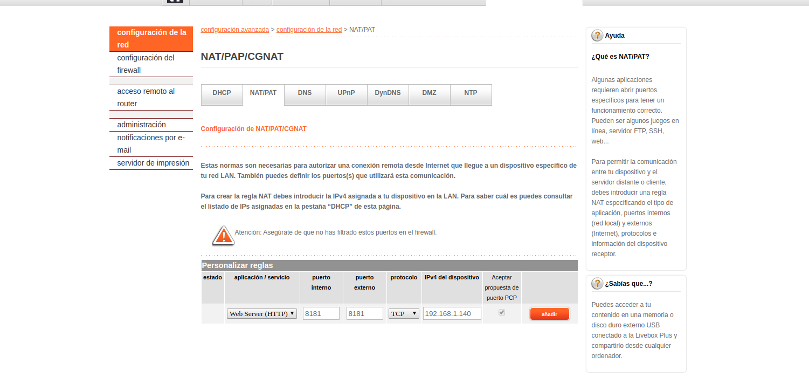
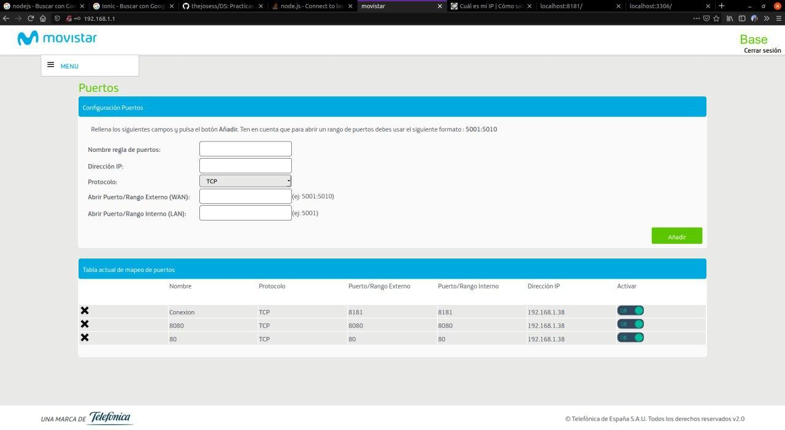
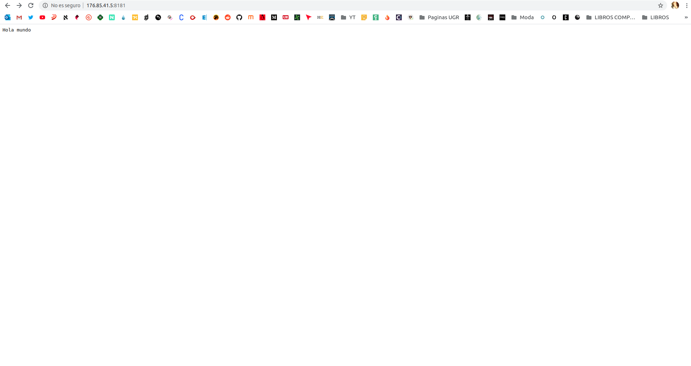
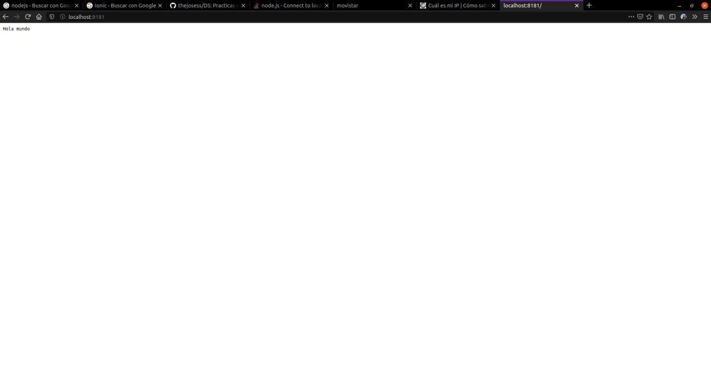
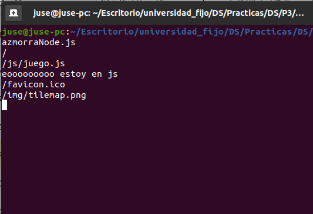
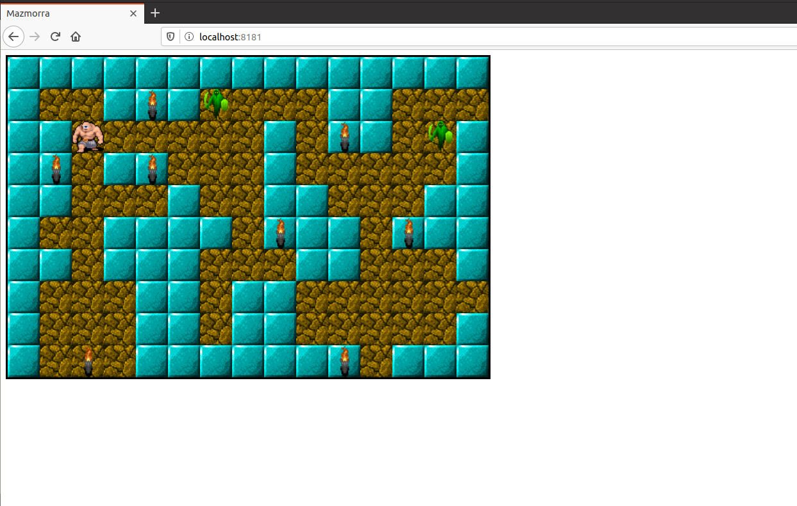

# Practica 3 ~ DS

[GitHub](https://github.com/thejosess/DS/tree/master/P3)

## Introducción 
Decidimos que queriamos realizar un juego en la web, inspirado en páginas como minijuegos de nuestra infancia. Para la parte lógica y "gráfica" del juego, utilizamos javascript (una tecnología que no hemos estudiando en la carrera) junto con HTML, y para la parte del servidor nodejs (visto brevemente en una asignatura).

### Juego con javascript 

Para la construcción del juego, tuvimos que buscar por internet para informarnos en como realziar un juego con javascript. Lo primero que realizamos fue la creación de una matriz que sería el mapa total.

    var escenario = [
    [0,0,0,0,0,0,0,0,0,0,0,0,0,0,0, 0,0,0,0,0,0,0,0,0,0,0,0,0,0,0],
    [0,2,2,0,0,0,2,2,2,2,0,0,2,2,2, 2,2,2,2,2,2,2,2,2,2,2,0,0,0,0],
    [0,0,2,2,2,2,2,2,0,2,0,0,2,2,0, 0,0,2,0,0,2,0,0,0,0,2,0,2,2,0],
    [0,0,2,0,0,2,2,2,0,2,2,2,2,2,0, 0,0,0,0,0,2,2,2,0,0,2,2,2,2,0],
    [0,0,2,2,2,0,2,2,0,0,2,2,2,0,0, 0,2,2,2,2,2,0,2,0,0,0,2,2,0,0],
    [0,2,2,0,0,0,0,2,0,0,0,2,0,0,0, 0,2,0,0,2,0,0,2,0,0,0,0,2,2,0],
    [0,0,2,0,0,0,2,2,2,0,0,2,2,2,0, 0,2,0,0,0,0,0,2,0,0,0,2,2,0,0],
    [0,2,2,2,0,0,2,0,0,2,2,2,2,2,2, 2,2,0,0,2,2,0,2,0,0,0,2,0,0,0],
    [0,2,2,2,0,0,2,0,0,2,2,2,2,2,0, 0,0,0,2,2,2,2,2,0,0,0,2,2,0,0],
    [0,2,2,2,0,0,0,0,0,0,0,2,0,0,0, 0,0,0,0,0,0,2,0,0,0,0,2,2,0,0],

    [0,2,2,2,0,0,0,0,0,0,0,2,0,0,0, 0,0,0,0,0,0,2,0,0,0,0,2,2,0,0],
    [0,2,0,2,2,2,0,0,0,0,0,2,2,2,0, 0,0,0,0,0,2,2,2,0,2,2,2,2,2,0],
    [0,2,0,2,2,2,0,0,0,0,0,2,0,0,0, 0,0,0,0,0,2,2,2,0,0,0,0,2,2,0],
    [0,2,0,0,0,2,2,2,2,2,2,2,0,2,0, 0,0,0,0,0,0,2,0,0,0,0,0,2,0,0],
    [0,2,0,0,0,2,0,0,0,0,0,2,0,2,2, 2,0,0,2,2,2,2,0,0,0,2,2,2,0,0],
    [0,2,2,2,0,2,0,0,2,2,0,2,0,0,2, 2,0,0,2,2,2,2,0,0,0,2,2,0,0,0],
    [0,2,0,2,0,0,2,0,2,2,0,2,0,0,2, 2,0,0,2,0,0,2,0,0,2,2,2,0,0,0],
    [0,0,0,2,0,0,2,0,2,2,2,2,0,0,2, 2,2,2,2,0,0,2,0,2,2,2,2,2,2,0],
    [0,0,0,2,2,2,2,0,0,0,0,0,0,0,0, 0,0,0,0,0,0,0,0,2,2,2,2,2,2,0],
    [0,0,0,0,0,0,0,0,0,0,0,0,0,0,0, 0,0,0,0,0,0,0,0,0,0,0,0,0,0,0]
    ];

Tras crear el "mapa", colocamos los objetos que conforma el nivel de forma aleatorio.

    function colocarObjetos(objeto)
    {
        colocado = false;

        while(!colocado)
        {
            fila = random(1,altoEscenario-2);
            columna = random(1,anchoEscenario-2);
            console.log('random: ' + fila + ', ' + columna);
            
            for(var y = fila; y < altoEscenario-1; y++)
            {
                for(var x = columna; x < anchoEscenario-1; x++)
                {
                    if(escenario[y][x] == tierra)
                    {
                        console.log(objeto + ' en pos (' + y + ', ' + x + ')');
                        escenario[y][x] = objeto;
                        colocado = true;
                        break;
                    }
                }

                if(colocado)
                    break;
            }
        }
    }

Para "dibujar" todos estos elementos en el navegador, hacemos uso de una clase llamada Camara y es el método dibujar el que se encarga de esto mediante el método drawImage y las coordenadas.

    dibujar()
    {
        // Escenario
        for(var y = this.y; y < this.alto + this.y; y++)
        {
            for(var x = this.x; x < this.ancho + this.x; x++)
            {
                var tile = escenario[y][x];
                ctx.drawImage(tileMap, tile*tileWith,0, tileWith,tileWith, (x - this.x + this.posX)*anchoF,(y - this.y + this.posY)*altoF, anchoF,altoF);
            }
        }

        // Protagonista
        if((protagonista.x >= this.x) && (protagonista.x < this.x + this.ancho) && (protagonista.y >= this.y) && (protagonista.y < this.y + this.alto))
            ctx.drawImage(tileMap, 1*tileWith,1*tileWith, tileWith,tileWith, (protagonista.x - this.x + this.posX)*anchoF,(protagonista.y-this.y+this.posY)*altoF, anchoF,altoF);

        // Enemigos
        enemigos.forEach(enemigo => {
            if((enemigo.x >= this.x) && (enemigo.x < this.x + this.ancho) && (enemigo.y >= this.y) && (enemigo.y < this.y + this.alto))
                ctx.drawImage(tileMap, 0*tileWith,1*tileWith, tileWith,tileWith, (enemigo.x - this.x + this.posX)*anchoF,(enemigo.y-this.y+this.posY)*altoF, anchoF,altoF);
        });

        // Antorchas
        antorchas.forEach(antorcha => {
            if((antorcha.x >= this.x) && (antorcha.x < this.x + this.ancho) && (antorcha.y >= this.y) && (antorcha.y < this.y + this.alto))
                ctx.drawImage(tileMap, antorcha.fotograma*tileWith,2*tileWith, tileWith,tileWith, (antorcha.x - this.x + this.posX)*anchoF,(antorcha.y-this.y+this.posY)*altoF, anchoF,altoF);
        });
    }

La camara apunta a una posición especifica del mapa, el mapa está divido en cuatro partes y cuando el jugador se mueve, se verifica en qué cuadrante está y así se muestra un cuadrate u otro en el navegador. Esto se verifica cuando el jugador se mueve (arriba, derecha, izquierda, derecha) y si el jugador se ha movido a otro cuadrante, se cambia de camara.

La clase jugador se encarga del control del mismo, también se encarga de realizar la gestión de los eventos al interacturar con ciertos objetos:

    interactuar()
    {
        var objeto = escenario[this.y][this.x];
        
        if(objeto == llave)
        {
            escenario[this.y][this.x] = tierra;

            if(this.llave1)
            {
                alert("Has encontrado otra llave!!!!! Ya tienes dos!!");
                this.llave2 = true;
            }
            else
            {
                alert("Has encontrado una llave!!");
                this.llave1 = true;
            }
        }
        else if(objeto == puerta)
        {
            if(this.llave2)
            {
                alert("HAS ESCAPADO DEL LABERINTO!!!");
                reiniciar();
            }
            else if(this.llave1)
            {
                alert("Tienes una llave... pero la cerradura es para dos llaves!!!");
            }
            else
                alert("Puerta cerrada");
        }
    }

y la colisión con los enemigos

    colision(x,y)
    {
        if(escenario[y][x] == muro)
            return true;
        else
            return false;
    }

    colisionEnemigo(x,y)
    {
        if(this.x == x && this.y == y)
        {
            alert('Un enemigo te ha matado :(');
            reiniciar();
        }
    }

El enemigo es una clase que se mueve de forma aleatoria y que al cochar con el jugador, se acaba esa partida.

Todo ello conforma el juego y es en el html donde se llama la función inicializar que dibuja todos los elementos en el html haciendo uso de imagenes para ilustrarlo. 

    function inicializar()
    {
        canvas = document.createElement("CANVAS");
        canvas.setAttribute("id", "canvas");
        canvas.style.width = canvasWidth;
        canvas.style.height = canvasHeight;
        canvas.style.border = "3px solid black"
        document.body.appendChild(canvas);
        
        ctx = canvas.getContext('2d');
        
        tileMap = new Image();
        tileMap.src = "img/tilemap.png"

        camara1 = new Camara(0,0, anchoVisible,altoVisible, 0,0);
        camara2 = new Camara(anchoEscenario/2,0, anchoVisible,altoVisible, 0,0);
        camara3 = new Camara(0,altoEscenario/2, anchoVisible,altoVisible, 0,0);
        camara4 = new Camara(anchoEscenario/2,altoEscenario/2, anchoVisible,altoVisible, 0,0);
        camara = camara1;

        protagonista = new Jugador();

        enemigos.push(new Enemigo(1,8));
        enemigos.push(new Enemigo(13,1));
        enemigos.push(new Enemigo(8,6));
        enemigos.push(new Enemigo(5,11));
        enemigos.push(new Enemigo(9,15));
        enemigos.push(new Enemigo(28,2));
        enemigos.push(new Enemigo(27,18));

        antorchas.push(new Antorcha(1,3));
        antorchas.push(new Antorcha(4,1));
        antorchas.push(new Antorcha(4,3));
        antorchas.push(new Antorcha(10,2));
        antorchas.push(new Antorcha(10,9));
        antorchas.push(new Antorcha(0,9));
        antorchas.push(new Antorcha(12,5));
        antorchas.push(new Antorcha(8,5));
        antorchas.push(new Antorcha(4,7));

        antorchas.push(new Antorcha(0,12));
        antorchas.push(new Antorcha(1,17));
        antorchas.push(new Antorcha(7,12));
        antorchas.push(new Antorcha(7,17));
        antorchas.push(new Antorcha(10,15));
        antorchas.push(new Antorcha(4,17));
        antorchas.push(new Antorcha(12,13));

        antorchas.push(new Antorcha(16,0));
        antorchas.push(new Antorcha(20,0));
        antorchas.push(new Antorcha(20,5));
        antorchas.push(new Antorcha(17,6));
        antorchas.push(new Antorcha(23,5));
        antorchas.push(new Antorcha(25,8));
        antorchas.push(new Antorcha(28,6));
        antorchas.push(new Antorcha(26,2));
        antorchas.push(new Antorcha(19,9));

        antorchas.push(new Antorcha(19,11));
        antorchas.push(new Antorcha(25,12));
        antorchas.push(new Antorcha(19,16));
        antorchas.push(new Antorcha(21,18));
        antorchas.push(new Antorcha(25,19));
        antorchas.push(new Antorcha(27,15));

        colocarObjetos(puerta);
        colocarObjetos(llave);
        colocarObjetos(llave);

        document.addEventListener('keydown',function(tecla)
        {
            switch (tecla.key) {
                case 'ArrowDown':
                    protagonista.abajo();
                    // camara.abajo();
                break;
        
                case 'ArrowUp':
                    protagonista.arriba();
                    // camara.arriba();
                break;
        
                case 'ArrowLeft':
                    protagonista.izquierda();
                    // camara.izquierda();
                break;
        
                case 'ArrowRight':
                    protagonista.derecha();
                    // camara.derecha();
                break;

                case 'r':
                    reiniciar();
                break;
            
                default:
                    break;
            }
        });
    
        setInterval(principal, 1000/FPS);
    }

Archivo html 

    <html>

        <head>
            <meta charset="UTF-8">
            <title>Mazmorra</title>
            
        </head>

        <body onload='javascript:inicializar();'>
            
        </body>

    </html>

### Servidor con nodejs 
Uno de los primero problemas que nos encontramos al intentar realizar la parte del servidor fué la imposibilidad de trabajar juntos en un mismo servidor. Para ello lo primero que tuvimos que realizar fué la creación del servidor 

    var http = require("http");

    http.createServer(function(request, response) {
    response.writeHead(200, {"Content-Type": "text/html"});
    response.write("Hola Mundo");
    response.end();
    }).listen(8181);

Con el servidor creado, nos surgió la pregunta de como realizar esta conexión entre ordenadores situados fisicamente en lugares distintos. Tuvimos que abrir los puertos desde las páginas de movistar y orange (operadoras de los dos miembros). Hubo algunos problemas con el de orange, ya que para encontrar la sección donde abrir los puertos, tuvimos que estar buscando por internet.

Con los puertos abiertos, pudimos hacer un hola mundo entre ambos ordenadores

.

Tras esto nos disponiamos a cargar el fichero html directamente, tuvimos que buscar en internet como se cargaban ficheros en nuestro servidor nodejs y tras encontrar habia que especificiar el tipo de contenido con 'Content-Type': 'text/html'

    let http = require('http');
    let fs = require('fs');

    let handleRequest = (request, response) => {
    response.writeHead(200, {
            'Content-Type': 'text/html'
    });
    fs.readFile('./index.html', null, function (error, data) {
            if (error) {
            response.writeHead(404);
            respone.write('file not found');
            } else {
            response.write(data);
            }
            response.end();
    });
    };

    http.createServer(handleRequest).listen(8181);

Pero al realizar esto y tras mirar en opciones de desarrollador del navegador, nos dimos cuenta que el problema eran las rutas a la hora de cargar los archivos en el javascript.  
Para ello había que administrar como se servian los distintos ficheros desde el servidor

    let http = require('http');
    let fs = require('fs');
    
    let handleRequest = (request, response) => {
    console.log(request.url);
    if(request.url == '/js/juego.js')
    {    
            console.log("eooooooooo estoy en js");
            response.writeHead(200, {
            'Content-Type': 'text/javascript'
            });
            fs.readFile('js/juego.js', null, function (error, data) {
            if (error) {
                    response.writeHead(404);
                    response.write('Whoops! js not found!');
            } else {
                    response.write(data);
            }
            response.end();
            });
    }
    else if(request.url == '/img/tilemap.png')
    {    
            response.writeHead(200, {
            'Content-Type': 'image/png'
            });
            fs.readFile('img/tilemap.png', null, function (error, data) {
            if (error) {
                    response.writeHead(404);
                    response.write('Whoops! img not found!');
            } else {
                    response.write(data);
            }
            response.end();
            });
    }
    else
    {    
            response.writeHead(200, {
            'Content-Type': 'text/html'
            });
            fs.readFile('./index.html', null, function (error, data) {
            if (error) {
                    response.writeHead(404);
                    response.write('Whoops! File not found!');
            } else {
                    response.write(data);
            }
            response.end();
            });
    }
    };
    
    http.createServer(handleRequest).listen(8181);

Con todo ello, ya teníamos el servidor mostrando nuestro juego y pudiendo jugar desde ordenador en distintos lugares físicos.

.

También cabe destacar que usamos una extesión de visual studio code llamada live share  para trabajar sobre el mismo código en algunos momentos.

### Comunicación servidor-juego
Tras realizar el juego y el servidor, decidimos almacenar los objetos "llaves" en el servidor, siendo este el que le devuelve al juego si tiene las llaves. Uno de los problemas que nos encontramos fué que al ser la comunicación asíncrona mediante socket.io (módulo de nodejs), no eramos capaces de obtener el valor de estas llaves fuera del socket.on. Estuvimos probando otros módulos (skynet, socketcluster, SSE) y tras estar mucho tiempo detrás de esto, decidimos meter dentro del socket.on las distintas comprobaciones (todo ello en el método interactuar).

    if(objeto == llave)
    {
        socket.emit("get-llaves");
        socket.on("get-llaves", function(data) {
            escenario[this.y][this.x] = tierra;

            if(data.llave1)
            {
                alert("Has encontrado otra llave!!!!! Ya tienes dos!!");
                // this.llave2 = true;
                socket.emit("set-llave2", true);
            }
            else
            {
                alert("Has encontrado una llave!!");
                // this.llave1 = true;
                socket.emit("set-llave1", true);
            }
        });
    }
    else if(objeto == puerta)
    {
        socket.emit("get-llaves");
        socket.on("get-llaves", function(data) {
            if(data.llave2)
            {
                alert("HAS ESCAPADO DEL LABERINTO!!!");
                reiniciar();
            }
            else if(data.llave1)
            {
                alert("Tienes una llave... pero la cerradura es para dos llaves!!!");
            }
            else
                alert("Puerta cerrada");
        });
    }

### Implemetanción ranking con mongodb
Nuestro servicio además permite tener un ranking de la puntuación de las personas que han jugado las partidas (emulando los juegos de recreativas). Si te pasas el nivel consigues 5 puntos

    interactuar(){}
            ...

    else if(objeto == puerta)
    {
        if(this.llave2)
        {
            alert("HAS ESCAPADO DEL LABERINTO!!!");
            socket.emit("sumarPuntuacion");
            reiniciar();
        }
    }

Donde el servidor recibe esa llamada y sumar la puntuación en una variable que tiene (puntuacion) para lugar poder insertarla en la BD.

En el html donde está el juego, hay un campo para introducir tu nick y una lista con el ranking anterior. Este nick se guarda también en el servidor

    

        <form action="javascript:void(0);" onsubmit="javascript:enviarNick();">
            <label for="nick">Nick :</label>
            <input type="text" id="nick" name="nick">

            <input type="submit" value="Enviar información">
        </form>
    

Al inicio del html, se llama a la función inicializar y obtenerRaking

    function obtenerRanking(){
        socket.emit('ranking');
        socket.on('ranking',function(data){
            actualizarRanking(data);
        });
    }

En dicha función se llama al servidor con los últimos datos que tiene la BD y se llama a actualizarRanking (donde se añade a la lista del html)

    function actualizarRanking(data){
        var listElement = document.getElementById('list');
        var listItem = document.createElement('li');

        listItem.innerHTML = data;
        listElement.appendChild(listItem);
    }

Y es el servidor el que busca en la bd recorriendola por completa y trabajando con esa información

    
    client.on('ranking', function () {
        collection.find().sort({puntuacion:-1}).forEach(function(result){
            var informacion = result.nick + " con una puntuación de: " + result.puntuacion + " pts";
            console.log("enviando ranking");
            client.emit('ranking',informacion);
        });
    });

Con la creación básica de la BD, nos dispusimos a desarrollarla un poco más y permitir que si introduces un nick que ya existe, se actualice tu puntuación si es mayor que la anterior.   
Para ello, cada vez que el usuario muere y se llama a sesionTerminada, se comprueba si está en la BD y si es así se actualiza su nueva puntuación (añadir que solo se mete información en la BD si el usuario mete su nick).

    client.on("sesionTerminada", function(){
        if(nick != null && puntuacion != null)
        {
            console.log(nick);
            var puntuacion_anterior;
            collection.find({_id:nick}).toArray(function(err, result) {
                if(result.length == 0)
                {
                    var data = {_id:nick, nick:nick, puntuacion:puntuacion};
                    collection.insert(data, {safe:true}, function(err, result) {});
                    console.log("metido bd de forma correcta");
                    console.log(data);
                    puntuacion = 0;
                    client.emit("actualizar-ranking");
                }
                else
                {
                    collection.find({_id:nick}).forEach(function(result){
                        var data = {nick:nick, puntuacion:puntuacion};
                        puntuacion_anterior = result.puntuacion;
                        console.log(puntuacion_anterior);
                        console.log(puntuacion);
                        if(puntuacion > puntuacion_anterior)
                        {
                            console.log("modificando puntuacion")
                            collection.update({_id:nick},{$set:{puntuacion:puntuacion}});
                        }
                        puntuacion = 0;
                        client.emit("actualizar-ranking");
                    });
                }
            });
        }
    });

Si no lo encuentra (collections.find) se mete un nuevo valor a la BD, si lo encuentra, se actualiza su puntuación. Además tras insertar o actualizar en la BD, se llama a index.html para actualizar los valores del ranking con  client.emit("actualizar-ranking");   

Cabe destacar en este punto, que tuvimos ciertas dificultades a la hora de usar mongodb. Fue necesario tratar de forma correcta lo que nos devolvía colleciont.find (tipo cursor) y este resultado, convertirlo a un array (toArray) para poder comprobar su tamaño (length) y así poder modificar algún campo usando result

    collection.update({_id:nick},{$set:{puntuacion:puntuacion}});

Todo ello, es necesario trabajarlo mediante los callbacks, ya que si no, nos daba errores debido a su naturaleza asíncrona.

### Conclusiones
Durante el desarrollo de la práctica, nos encontramos con algunas dificultades asociadas al uso de tecnologías que no conociamos. La creación del juego nos tomo gran parte de nuestro tiempo debido a que apenas conociamos javascript (menos incluso que lo básico) y tras estudiarlo e informarnos (la utilización de imagenes, la forma de tratar con las camaras, movimiento de jugador y el canvas o mapa) pudimos crear un juego funcional.    
Para la creación del servidor usamos nodejs y socket.io para que se comuniquen el cliente y el servidor y para la MongoDB. Para la creación de la base de datos y la comunicación entre cliente y servidor, tuvimos que profundizafar en las características asíncronas de los mismos y sus capacidades con los callbacks, ya que era algo que chocaba con lo que habiamos estudiado hasta ahora.   
Nuestra idea original era crear una aplicación movil con android studio o con ionic y que con el móvil pudieses obtener el mapa del juego y el inventario así como una funcionalidad extra de resolver puzzles para conseguir pasar ciertas zonas del juego, sin embargo nuestras expectativas se vieron frustadas por el gran tiempo que nos llevo todo lo que hemos ido comentando hasta ahora y la ardua tarea que tiene la creación de un videojuego.   
La creación de esta práctica nos ha servido para darnos cuenta la gran importancía que tiene aprender nuevas tecnologías como frameworks, lenguajes o areas de trabajo distintas y el tiempo que esto conlleva.
